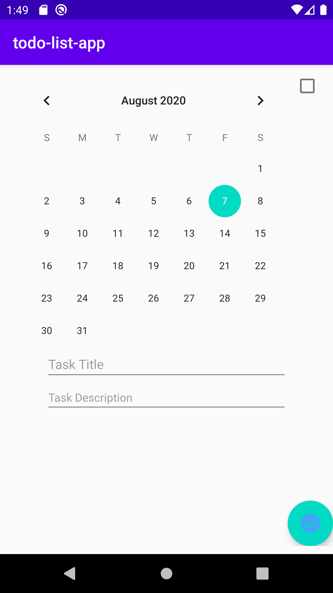
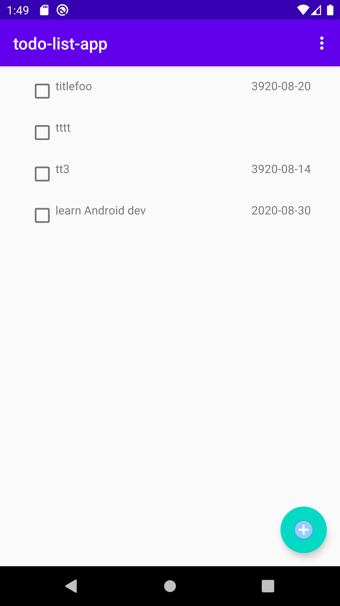
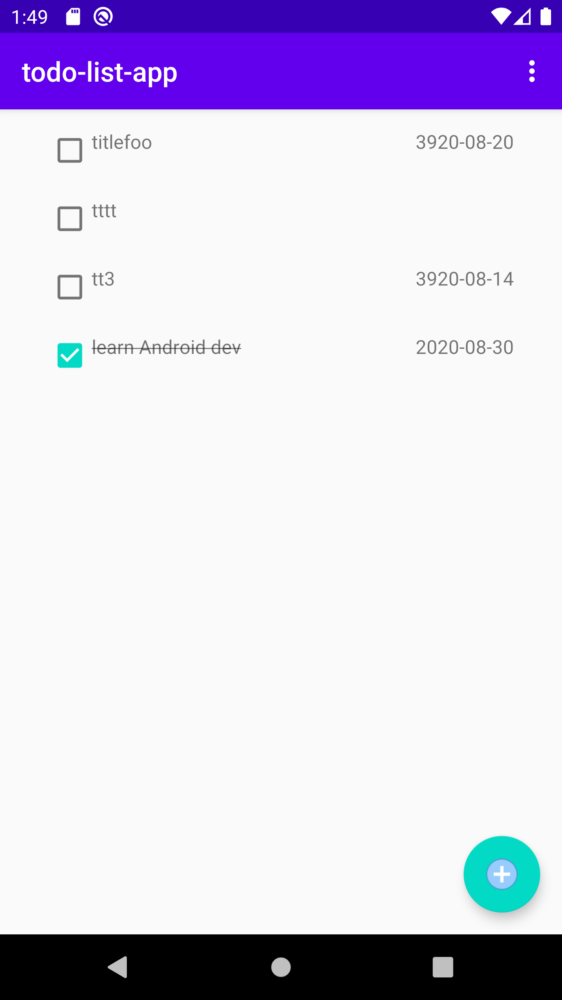
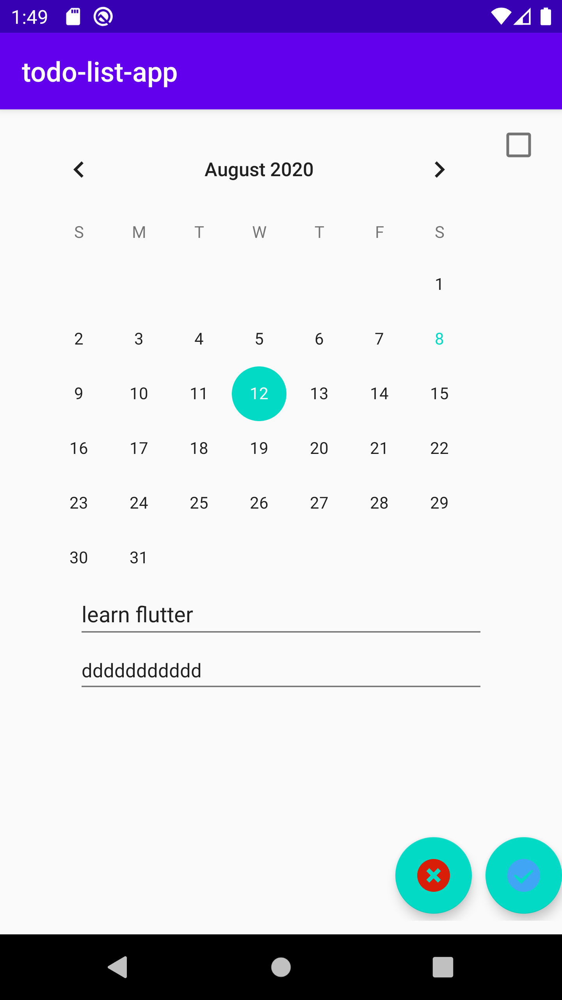

## my todo list app
目前已完成以下功能：
* login form 校验
* login
* logout（目前只在列表页面才显示logout menu items）
* add task
* toggle task completed status
* edit task
* delete task

### add task

### todo list

### complete task

### edit or delete task

